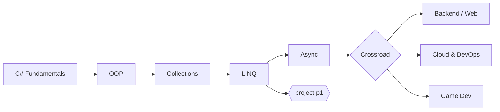
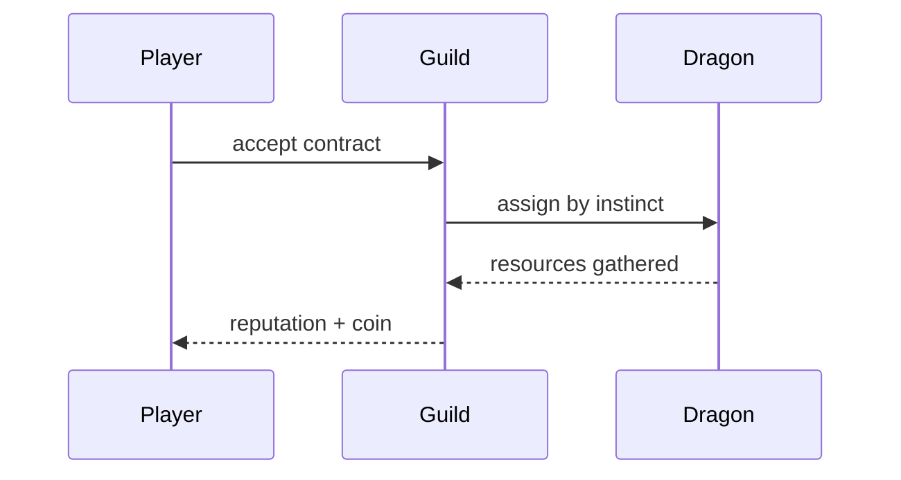

# Markdown Reference

Everything below renders. If something on this page looks wrong, the renderer is
wrong — that is the point of keeping it.

## Text

*Emphasis*, **strong**, ***both***, ~~struck through~~, `inline code`, and a
[link to the charter](../documentation/01-project-charter.md).

Wiki-links resolve against the whole workspace, so the file's location does not
matter: [[project-charter]], [[module-04-linq]], [[cp1]].

They take a heading anchor and an alias too:
[[implementation-roadmap#Milestone 1 — Console Prototype|the first milestone]].

A link to a file that does not exist renders as unresolved rather than silently
broken: [[this-document-does-not-exist]].

## Callouts

> [!NOTE]
> The neutral one. Use it for context the reader needs but did not ask for.

> [!TIP]
> Prefer `TryParse` over `Parse` in a loop — exceptions are not control flow.

> [!IMPORTANT]
> Checkpoints are closed-book. You do not advance without passing one.

> [!WARNING]
> `+=` on a string inside a loop is O(n²). Use `StringBuilder`.

> [!CAUTION]
> Never overturn a decision in [[meeting-minutes]] without reading why it was
> made.

## Code

Fenced blocks are highlighted at parse time, so nothing re-flows after the page
appears.

```csharp
public readonly record struct Money(decimal Amount, string Currency)
{
    public static bool TryParse(string? input, out Money money)
    {
        money = default;
        if (string.IsNullOrWhiteSpace(input)) return false;

        var parts = input.Split(' ', 2);
        if (parts.Length != 2 || !decimal.TryParse(parts[0], out var amount))
            return false;

        money = new Money(amount, parts[1]);
        return true;
    }
}
```

```sql
select level, count(*) as hits
from log_lines
where level in ('ERROR', 'WARN')
group by level
order by hits desc;
```

```bash
dotnet new console -o m01-d1-typelab
cd m01-d1-typelab && dotnet run
```

## Tables

| Module | Days | Checkpoint | Unlocks |
|---|---:|---|---|
| C# Fundamentals | 5 | `cp1` | Milestone 1 — Console Prototype |
| OOP | 5 | `cp2` | Milestone 2 — OOP Expansion |
| Collections & Generics | 4 | `cp3` | Milestone 3 — Collections |
| LINQ | 5 | `cp4` | project **p1** |

## Lists

- Dragons replace machinery
- Instincts replace abilities
  - A Stonejaw digs toward vibration
  - The guild follows the tunnel to the ore
- Every mechanic has to earn its place

1. Read the error
2. Read the relevant code
3. Form a hypothesis
4. Attempt a fix
5. Test the result

Task lists track state:

- [x] Convert the design documents
- [x] Reconcile the curriculum folder map
- [ ] Create the solution
- [ ] Create the Git repository

## Diagrams





## Images

Assets resolve from `assets/` regardless of where the document lives, and
filenames containing spaces work.


## Quotes and footnotes

> Code explains what the project does.
> Meeting Minutes explain why it does it.

A footnote reference[^why] and a second one[^cutoff] both link in each direction.

[^why]: Because rereading feels like learning and is not. Retrieval is the
    only practice that transfers.

[^cutoff]: Blocked more than thirty minutes? Write the question down, mark it
    ⚠, and move on. See [[stuck-protocol]].

## Horizontal rule

---

That is everything.
